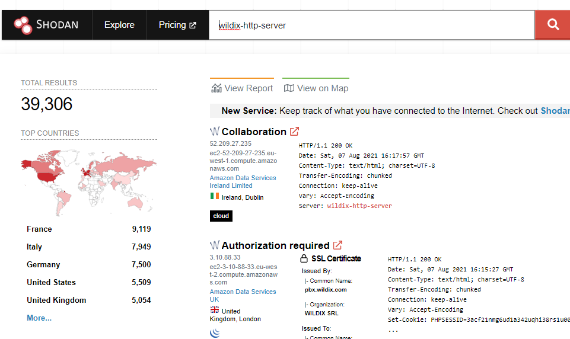

# WildixEnum
Wildix user enumeration and show live location

## Wildix
Wildix is a PBX with build-in call, chat and video chat functionality.

## What is this?
This script enumerates users via the Public Kite API and shows their Name and Location. In fact, you can chat and call with anyone on the PBX.

## How did you make this?
First, if you don't trust it, don't execute it. It's a compiled python script that brute forces the API with internal extentions, from 200 to 700.
If the API returns 200 OK, it reads and displays the data. This data contains live location.

<del>I would add a map with location markers, but python folium is broken on Windows v2004, so.. no map.</del>

## How do I know who's vulnerable?
Try google dork with `inurl:wildixin.com intext:"Wildix Collaboration"` or `intitle:"Kite Me" intext:"kite-chat"`, check wildixin.com on crt.sh or do a reverse ip lookup on hackertarget.com. Check dnsdumpster.com on Wildixin.com, or, my favorite, search on Shodan.io for `wildix-http-server`

Folium (map plugin) was fixed. If you use the decompiled python script version it'll display a map with the live location of the online users.

# Disclaimer
I am not responsible for any damage you might cause with this tool. I made it for educational purpose only.
